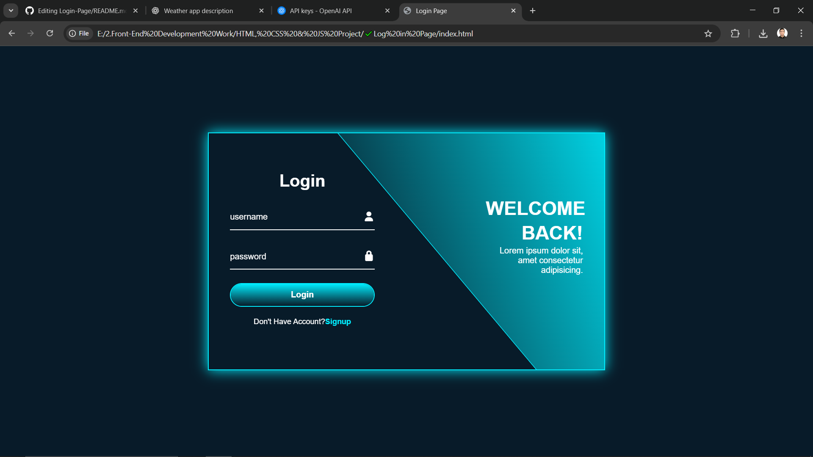

# 🔐 Responsive Login Page

A modern and fully responsive **Login Page UI** designed using **HTML**, **CSS**, and **JavaScript**.  
This project focuses on clean layout, stylish design, and user-friendly form controls. It can be used as a standalone login page or integrated into larger web projects.

---

## 📸 Screenshot

 <!-- Replace this with your actual screenshot path -->

---

## 🚀 Features

- 🖼️ Beautiful, CSS-driven modern design
- 📱 Fully responsive (mobile & desktop)
- 🔒 Show/Hide Password toggle
- ❗ Built-in structure for validation logic
- 🎨 Smooth hover and focus effects
- ⚙️ Clean layout using Flexbox or Grid
- 📂 Easy to integrate into real websites

---

## 🛠️ Technologies Used

- HTML5  
- CSS3 (focus on transitions, layout, responsiveness)  
- JavaScript (for interactivity)

---

## 📦 Getting Started

### 1. Clone the repository

```bash
git clone https://github.com/your-username/login-page.git
cd login-page
```

## 2. Open in Browser
Just open the index.html file in your browser.
No build tools or setup required.

## 📁 Folder Structure
login-page/
├── index.html

├── style.css

├── script.js

├── img/

│   └── login-page-screenshot.png
└── README.md

## 🧠 How It Works
- The form includes fields for email/username and password
- JavaScript adds functionality like:
- Show/hide password
- Basic validation handling
- CSS handles responsive layout, input styles, buttons, and transitions

## 📄 License
This project is licensed under the MIT License.
You're free to use, modify, and share it for personal or commercial use.

## 👨‍💻 Author
Munir Rahman
Front-End Web Developer

## ⭐ Support
If you find this project helpful or inspiring, please give it a ⭐ on GitHub!

---

Let me know if:
- You want the README in **Pashto**
- Your login page has extra features like animations, backend connection, dark mode, etc.

I’ll gladly customize this further for you!


